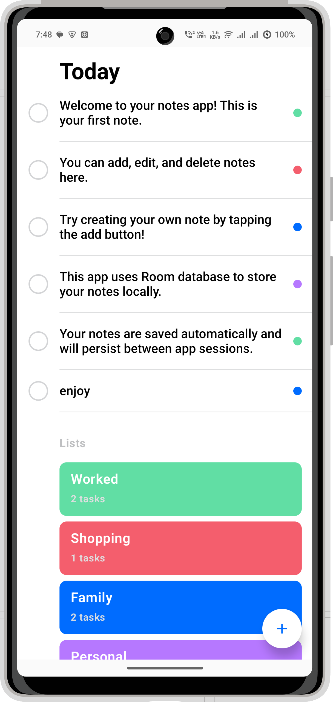
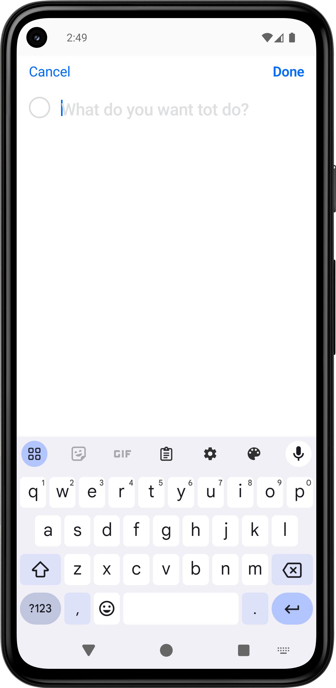
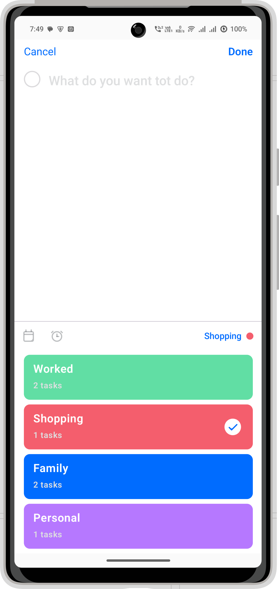
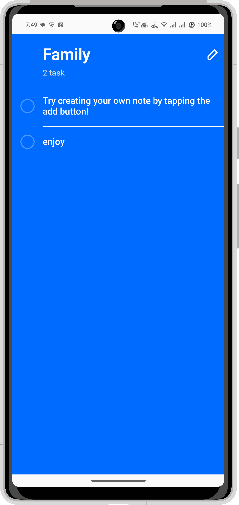

[](https://github.com/vicky7230/TASKER-multi-module/actions/workflows/android-ci.yml)

# Tasker

> 🚧 **This project is currently in active development. Features and structure may change frequently.**

Tasker is a modular, modern Android application designed to help you manage tasks and notes efficiently. Built with Clean Architecture and MVVM design pattern, Tasker leverages the latest Android technologies for scalability, maintainability, and a delightful user experience.

---

## 📱 App Screenshots

<div style="text-align: center;">
  
  
  
  
</div>

## Tech Stack 📚

- [Kotlin](https://kotlinlang.org/) - Programming language
- [Jetpack Compose](https://developer.android.com/jetpack/compose) - Modern UI toolkit
- [Room Database](https://developer.android.com/jetpack/androidx/releases/room) - Local data storage
- [Dagger 2](https://dagger.dev/) - Dependency injection
- [Kotlin Coroutines](https://kotlinlang.org/docs/coroutines-overview.html) - Asynchronous
  programming
- [Clean Architecture](https://blog.cleancoder.com/uncle-bob/2012/08/13/the-clean-architecture.html) +
  MVVM pattern

For full list of dependencies used, please take a look at the [catalog](gradle/libs.versions.toml)
file.

## Development 🛠️

You can clone the repo and build it locally without requiring any changes.

**Prerequisites:**
- Android Studio Hedgehog or newer
- JDK 17+
- Android SDK 35

**Build commands:**
```bash
./gradlew build              # Build project
./gradlew testDebugUnitTest  # Run tests
./gradlew ktlintFormat       # Format code
./gradlew detekt             # Static analysis
```

## Contributing 🛠️

You can contribute bug fixes to the project via PRs, for anything else open an issue to start a
conversation.

This project uses ktlint for code formatting. Run `./gradlew ktlintFormat` to format the code before
raising a PR.

## License

[Apache 2.0 License](LICENSE)

## Made with 💖 by

[Vicky](https://github.com/vicky7230)
