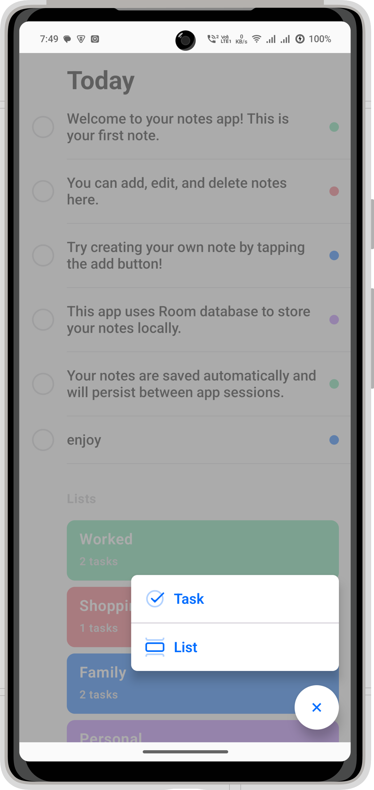

[](https://github.com/vicky7230/TASKER-multi-module/actions/workflows/android-ci.yml)

# Tasker

> 🚧 **This project is currently in active development. Features and structure may change frequently.**

Tasker is a modular, modern Android application designed to help you manage tasks and notes efficiently. Built with a clean architecture, Tasker leverages the latest Android technologies for scalability, maintainability, and a delightful user experience.

---

<div style="text-align:center;">

</div>

<div style="text-align:center;">
  
  
</div>

## ✨ Features

- 📝 Create, edit, and manage notes
- 📋 Organize tasks efficiently
- 🔍 Modular architecture for easy feature expansion
- 💡 Built with Jetpack Compose for a modern UI
- 🗄️ Uses Room for local data storage
- ⚡ Fast, responsive, and easy to use
- 🔄 Uses Kotlin Coroutines for asynchronous programming

---

## 🏗️ Project Structure

```
Tasker/
├── app/                        # Main application module
├── feature/
│   ├── notes/                  # Notes feature (data, domain, ui)
│   └── add_edit_note/          # Add/Edit Note feature (data, domain, ui)
├── core/
│   ├── common/                 # Common utilities
│   ├── network/                # Networking layer
│   ├── database/               # Database layer
│   └── feature_api/            # Feature API contracts
└── ...
```

---

## 🛠️ Tech Stack

- **Kotlin**
- **Jetpack Compose**
- **Room (Database)**
- **KSP (Kotlin Symbol Processing)**
- **AndroidX**
- **Kotlin Coroutines**
- **Modular Gradle Setup (Kotlin DSL)**

---

## 🚀 Getting Started

1. **Clone the repository:**
   ```sh
   git clone https://github.com/your-username/Tasker.git
   ```
2. **Open in Android Studio** (Giraffe or newer recommended)
3. **Configure your local.properties** (Android SDK path)
4. **Build & Run** the project on your device or emulator

---

## 🧩 Architecture

Tasker follows a modular Clean Architecture approach:

- **Core modules** provide shared functionality (network, database, utilities)
- **Feature modules** are split into `data`, `domain`, and `ui` layers for separation of concerns
- **Dependency Injection** and **KSP** are used for scalable code generation and management

---

## 🤝 Contributing

Contributions are welcome! Please open issues and submit pull requests for new features, bug fixes, or improvements.

1. Fork the repository
2. Create your feature branch (`git checkout -b feature/YourFeature`)
3. Commit your changes (`git commit -am 'Add new feature'`)
4. Push to the branch (`git push origin feature/YourFeature`)
5. Open a Pull Request

---

## 📄 License

This project is licensed under the [Apache 2.0 License](LICENSE).

---

## 🙏 Acknowledgements

- [Android Developers](https://developer.android.com/)
- [Jetpack Compose](https://developer.android.com/jetpack/compose)
- [Room Persistence Library](https://developer.android.com/jetpack/androidx/releases/room)

---

> Made with ❤️ by Vicky
